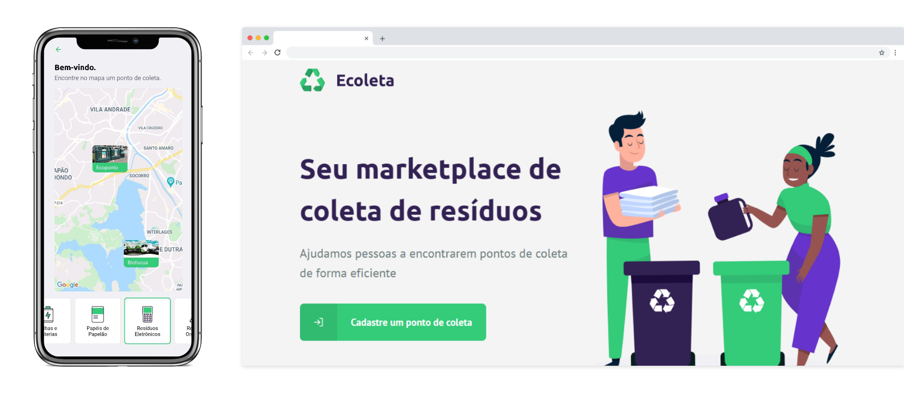

<div align="center">

## 

<br />

[](https://app.netlify.com/sites/ecoleta-nlw/deploys)  

</div>



## 💡 Projeto

O projeto busca ajudar pessoas a encontrarem pontos de coleta de materias próximos, no objetivo de melhorar o meio ambiente.

## 💻 Demo

[https://ecoleta-nlw.netlify.app](https://ecoleta-nlw.netlify.app)

### 📱 App

[Download para Android](https://github.com/jeferson-sb/ecoleta/releases/tag/1.0.0)

## 🛠️ Ferramentas

- [Node.js](https://nodejs.org/en/docs/)
- [React](https://reactjs.org/)
- [React Native](http://reactnative.dev/)
- [React Navigation](https://reactnavigation.org/)
- [Knex](http://knexjs.org/)
- [Express](http://expressjs.com/)
- [Multer](https://www.npmjs.com/search?q=multer)
- [Celebrate](https://www.npmjs.com/package/celebrate)
- [Yup](https://www.npmjs.com/package/yup)
- [Axios](https://www.npmjs.com/package/axios)
- [SQLite3](https://www.npmjs.com/package/sqlite3)
- [pg](https://www.npmjs.com/package/pg)
- e mais...

## 🚀 Quick start

### Instalação

```bash
$ cd ecoleta
$ cd web && yarn
```

```bash
$ cd .. && cd server
$ yarn
$ yarn knex:migrate && yarn knex:seed
```

### Utilização

```bash
$ cd web
$ yarn start
```

> Abra outro terminal na mesma pasta e rode

```bash
$ cd backend
$ yarn dev
```

> Renomeie `.env.example` para `.env` e mude o seu ip

[Veja todos os endpoints](./server/README.md)

## To-Do

- [x] Release apk 1.0.0
- [ ] Implementar Yup
- [ ] Implementar Styled Components
- [ ] Criar testes
- [ ] Criar dashboard para visualizar, excluir e deletar pontos

## 🤝 Como Contribuir

1. Faça um Fork no repositório
2. Crie sua branch: `git checkout -b featureXYZ`
3. Faça commit das suas alterações desejadas: `git commit -m "feat: Feature Linda"`
4. Faça o push: `git push origin featureXYZ`
5. Aguarde o review do mantenedor

## 💅 Design

[Figma File](https://www.figma.com/file/1SxgOMojOB2zYT0Mdk28lB/Ecoleta)

## 📝 Licença

Este projeto está sob a licença [MIT](https://github.com/jeferson-sb/ecoleta/blob/master/LICENSE.md)
